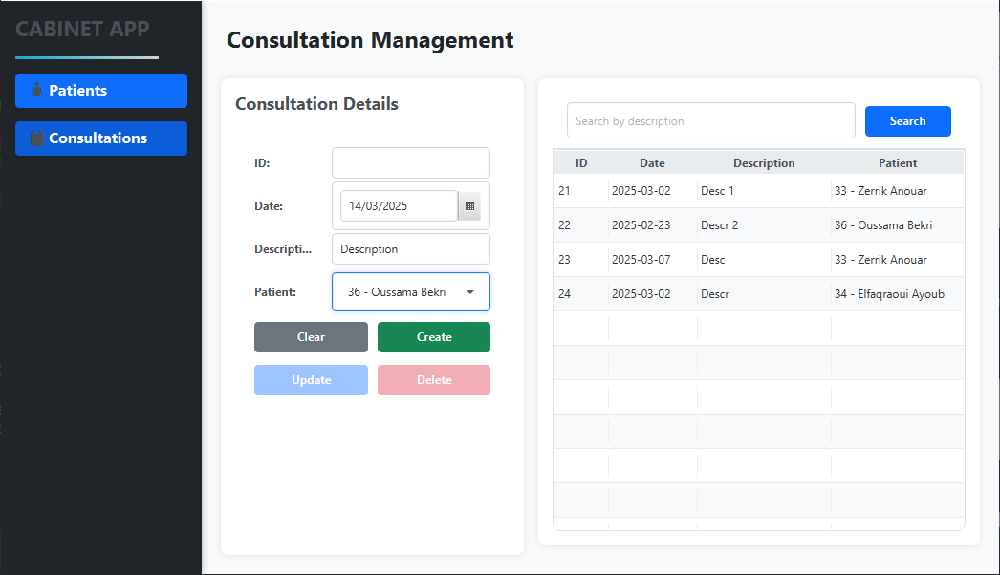

# Gestion Cabinet - JavaFX Application

This is a JavaFX application for managing a medical office, including CRUD operations for patients and consultations.

## Application Interfaces

### Patient Management Interface
This interface allows users to manage patient records, including creating, updating, deleting, and searching for patients.

#### Patient List

  

#### Add Patient

  
  
  

#### Edit Patient

  
  
  

#### Delete Patient

  
  

#### Search Patient

  

### Consultation Management Interface
This interface enables users to handle consultation records with CRUD functionalities and search options.

#### Consultation List

#### Add Consultation

  
  
  

#### Edit Consultation

  
  
  

#### Delete Consultation

  
  

#### Search Consultation

  

## Features
- CRUD operations for Patients.
- CRUD operations for Consultations.
- User-friendly JavaFX UI.
- Search functionality.
